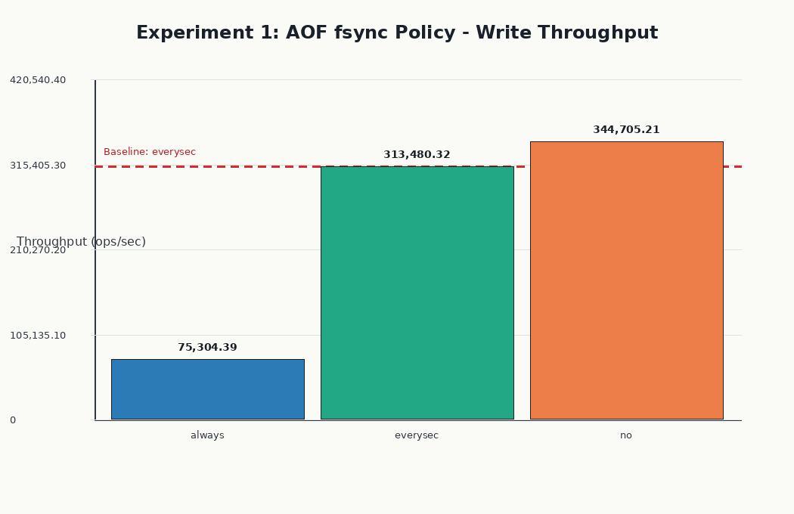
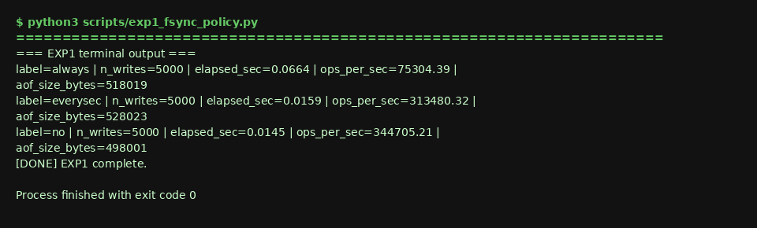
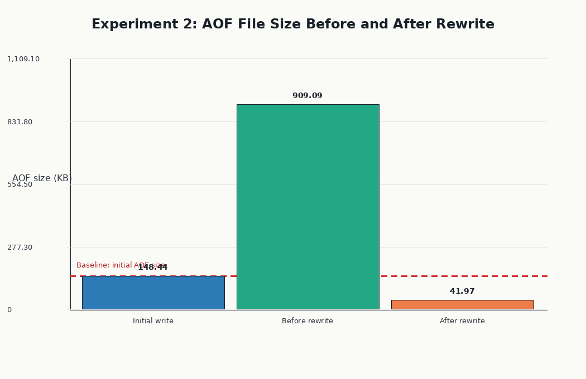
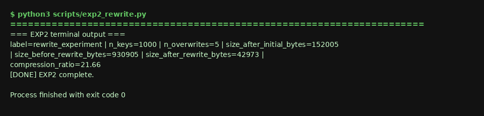
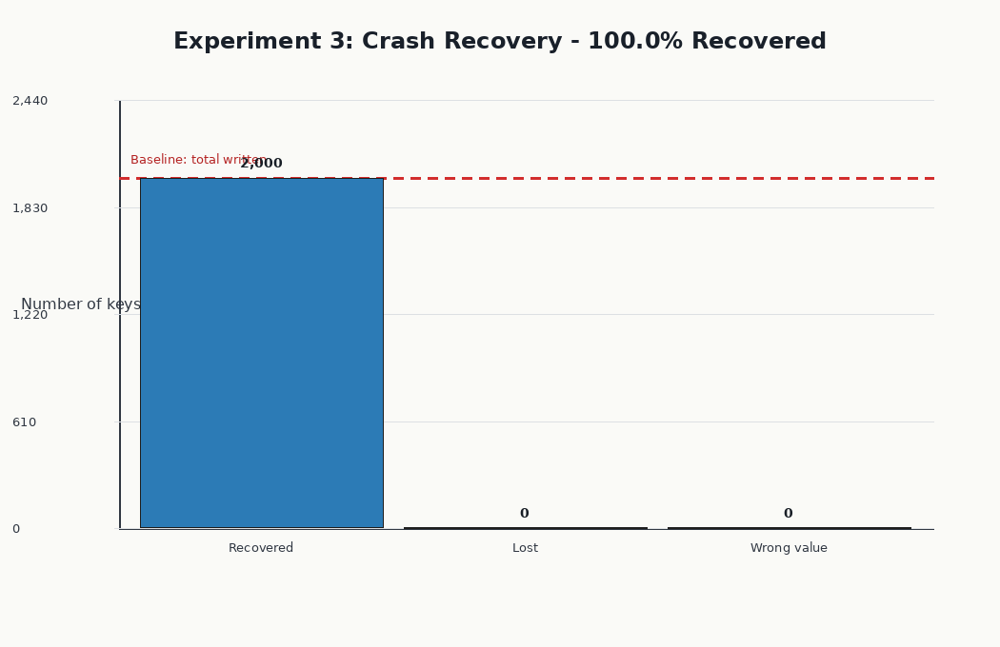
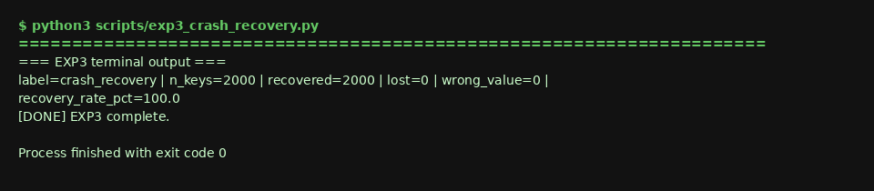
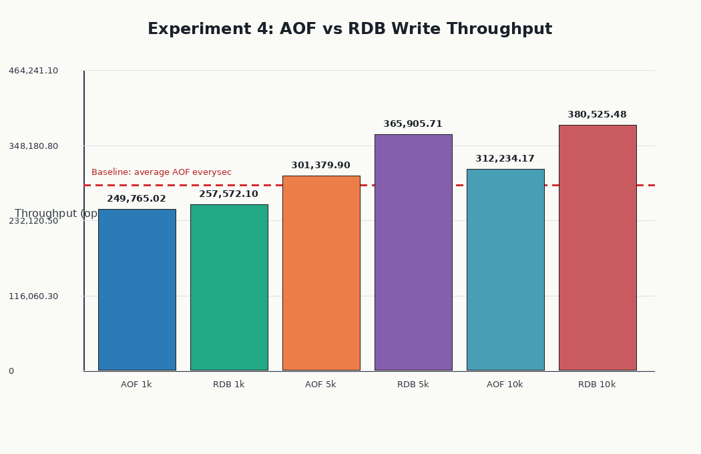
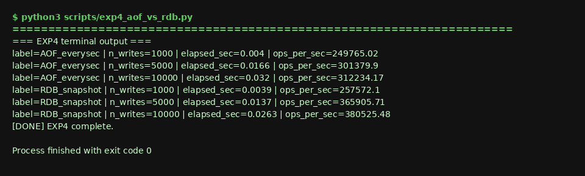
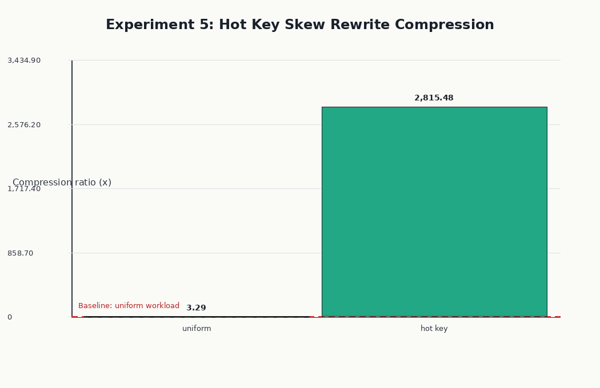
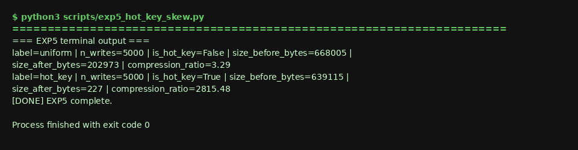

# DS614 Final Project - Redis AOF Persistence
**Topic:** Redis Append-Only File (AOF) Persistence  
**System:** Redis open source, built from the cloned repository at `../redis`  
**Team:** Purav Shah, Jay Salot (Quantum Data)


---

## 1. What Problem Does This System Solve?

Redis is an in-memory key-value store. Without persistence, all data is lost when the process terminates. The Append-Only File (AOF) mechanism solves the durability problem by writing every mutating command to a sequential log on disk. On restart, Redis replays this log to reconstruct in-memory state.

**Entry point in code:** `src/aof.c:feedAppendOnlyFile()` at line 1409. It is reached from `src/server.c:call()` at line 3894 through Redis command propagation.

---

## 2. Execution Path Trace: Write Path

```text
Client sends: SET foo bar
       |
src/server.c:processCommand()       parses and validates command
       |
src/server.c:call()                 executes the command
       |
src/server.c:propagate()            decides what to persist
       |
src/aof.c:feedAppendOnlyFile()      formats command as RESP and appends to server.aof_buf
       |
src/aof.c:flushAppendOnlyFile()     writes buffer to the OS and conditionally fsyncs
```

AOF format example:

```text
*3\r\n$3\r\nSET\r\n$3\r\nfoo\r\n$3\r\nbar\r\n
```

---

## 3. Design Decisions

### Decision 1: Three-Level fsync Control (`appendfsync`)

| Setting | Code Location | Behavior | Trade-off |
|---|---|---|---|
| `always` | `src/aof.c:flushAppendOnlyFile()` lines 1147-1357 | fsync after each write path flush | strongest durability, lowest throughput |
| `everysec` | same function, plus `server.aof_fsync` checks at lines 1168, 1183, and 1347 | fsync approximately once per second | balanced throughput and bounded loss window |
| `no` | same function | skips Redis-managed fsync | highest throughput, durability delegated to OS |

`src/config.c` maps the `appendfsync` option into `server.aof_fsync` at line 3193, and `src/server.h` stores that field at line 2218. This design lets operators choose the durability/performance tradeoff per deployment.

### Decision 2: AOF Rewrite via Fork

`src/aof.c:rewriteAppendOnlyFileBackground()` at line 2744 starts background rewrite work; `src/aof.c:rewriteAppendOnlyFile()` at line 2664 emits a compact representation of the current keyspace. The design prevents unbounded log growth while allowing the parent process to keep serving clients. Its cost is fork and copy-on-write memory pressure during rewrite.

### Decision 3: RESP Protocol in AOF

`src/aof.c:catAppendOnlyGenericCommand()` at line 1357 serializes commands using the Redis Serialization Protocol. This keeps the log inspectable and repairable by Redis tooling, but the text-like framing is larger than a custom binary format.

---

## 4. Concept Mapping

| DS614 Concept | Redis AOF Implementation |
|---|---|
| Write-Ahead Log (WAL) | AOF records mutations in an append-only log before replay-based recovery |
| Log-Structured Storage | AOF appends sequentially and later compacts with `BGREWRITEAOF` |
| Fault Tolerance / Crash Recovery | `src/aof.c:loadAppendOnlyFiles()` at line 1775 replays the log; truncated tails are checked during startup |
| Partitioning / Replication | Each Redis shard owns its persistence files; replicas receive command streams rather than AOF file shipping |
| Streaming / Ingestion | AOF is a continuous write stream that is read sequentially during recovery |
| Sequential vs Random I/O | AOF favors sequential appends; RDB snapshotting in `src/rdb.c:rdbSaveBackground()` at line 1942 writes periodic full snapshots |

---

## 5. Experiments and Results

### Baseline

**Config:** `appendfsync everysec`, AOF enabled, RDB disabled  
**Workload:** 5000 SET operations through `redis-cli --pipe`  
**Purpose:** Establish normal AOF throughput and file growth.

### Experiment 1 - AOF fsync Policy Comparison

**Manual run pipeline:**

```bash
python3 scripts/exp1_fsync_policy.py
cat results/exp1/results.tsv
```

**Hypothesis:** `appendfsync always` will be slower than `everysec` because it can force a disk flush on each write path flush.

**Code reference:** `src/aof.c:flushAppendOnlyFile()` line 1147; the `server.aof_fsync == AOF_FSYNC_ALWAYS` branch is checked around lines 1177, 1279, and 1330.

**Plot:** `ds614-redis-aof/plots/exp1_fsync_throughput.png`  


**Terminal screenshot:** `ds614-redis-aof/screenshots/exp1_terminal.png`  


**Results:**

| fsync Mode | Time (s) | Throughput (ops/sec) | AOF Size (bytes) |
|---|---|---|---|
| always | 0.0664 | 75,304.39 | 518,019 |
| everysec (baseline) | 0.0159 | 313,480.32 | 528,023 |
| no | 0.0145 | 344,705.21 | 498,001 |

**Observation:** `everysec` reached 313,480.32 ops/sec, about 4.16x the throughput of `always`. The `no` mode was fastest in this run at 344,705.21 ops/sec. AOF file sizes were close because all modes logged the same commands; fsync policy changes when data is forced to disk, not what is logged.

**Explanation:** With `appendfsync always`, Redis pays a durability barrier much more often. With `everysec`, `flushAppendOnlyFile()` can defer fsync work to the periodic path, separating most client writes from disk flush latency.

### Experiment 2 - AOF Rewrite Threshold Behavior

**Manual run pipeline:**

```bash
python3 scripts/exp2_rewrite.py
cat results/exp2/results.tsv
```

**Hypothesis:** After repeated overwrites, the AOF contains redundant history; `BGREWRITEAOF` should compact it to the current state.

**Code reference:** `src/aof.c:rewriteAppendOnlyFile()` line 2664 writes live keyspace state, and `src/aof.c:rewriteAppendOnlyFileBackground()` line 2744 starts the background rewrite.

**Plot:** `ds614-redis-aof/plots/exp2_rewrite_sizes.png`  


**Terminal screenshot:** `ds614-redis-aof/screenshots/exp2_terminal.png`  


**Results:**

| Metric | Value |
|---|---|
| Keys written | 1000 |
| Overwrites | 5 |
| AOF size after initial write | 152,005 bytes |
| AOF size before rewrite | 930,905 bytes |
| AOF size after rewrite | 42,973 bytes |
| Compression ratio | 21.66x |

**Observation:** Rewrite reduced the AOF from 930,905 bytes to 42,973 bytes, a 21.66x compression ratio.

**Explanation:** Each overwrite appends a fresh SET command, even for the same logical key. Rewrite discards historical commands and writes one final value per live key.

### Experiment 3 - AOF Recovery After Simulated Crash

**Manual run pipeline:**

```bash
python3 scripts/exp3_crash_recovery.py
cat results/exp3/results.tsv
```

**Hypothesis:** After `SIGKILL`, Redis can recover all fsynced AOF data. With `appendfsync everysec`, writes inside the last roughly one second may be at risk.

**Code reference:** `src/aof.c:loadAppendOnlyFiles()` line 1775 loads AOF files during startup and replays commands to rebuild state.

**Plot:** `ds614-redis-aof/plots/exp3_recovery_rate.png`  


**Terminal screenshot:** `ds614-redis-aof/screenshots/exp3_terminal.png`  


**Results:**

| Metric | Value |
|---|---|
| Keys written before crash | 2000 |
| Keys recovered | 2000 |
| Keys lost | 0 |
| Recovery rate | 100.0% |

**Observation:** Redis recovered 2000 of 2000 keys, for a 100.0% recovery rate, with 0 lost keys.

**Explanation:** The experiment waited 2.5 seconds before `SIGKILL`, giving the `everysec` policy enough time to flush and fsync the AOF data. On restart, Redis replayed the AOF log and reconstructed the keys.

### Experiment 4 - AOF vs RDB Write Throughput

**Manual run pipeline:**

```bash
python3 scripts/exp4_aof_vs_rdb.py
cat results/exp4/results.tsv
```

**Hypothesis:** RDB mode will have higher write throughput because normal writes do not append every command to a persistence log.

**Code reference:** AOF uses `src/aof.c:feedAppendOnlyFile()` line 1409 on mutation propagation; RDB snapshotting is handled by `src/rdb.c:rdbSaveBackground()` line 1942 outside the normal per-command write path.

**Plot:** `ds614-redis-aof/plots/exp4_aof_vs_rdb.png`  


**Terminal screenshot:** `ds614-redis-aof/screenshots/exp4_terminal.png`  


**Results:**

| Mode | n=1000 ops/sec | n=5000 ops/sec | n=10000 ops/sec |
|---|---|---|---|
| AOF (everysec) (baseline) | 249,765.02 | 301,379.90 | 312,234.17 |
| RDB snapshot | 257,572.10 | 365,905.71 | 380,525.48 |

**Observation:** At 10000 writes, RDB reached 380,525.48 ops/sec versus AOF at 312,234.17 ops/sec, a 1.22x RDB advantage in this run.

**Explanation:** AOF pays per-command log-buffer and write overhead. RDB mode can keep the write path memory-only until snapshot criteria trigger background persistence.

### Experiment 5 - AOF Under Write Skew (Hot Key)

**Manual run pipeline:**

```bash
python3 scripts/exp5_hot_key_skew.py
cat results/exp5/results.tsv
```

**Hypothesis:** Before rewrite, hot-key and uniform workloads should have similarly large AOFs because both issue 5000 commands. After rewrite, the hot-key AOF should shrink much more because only one live key remains.

**Code reference:** `src/aof.c:feedAppendOnlyFile()` line 1409 appends every SET regardless of key uniqueness; `src/aof.c:rewriteAppendOnlyFile()` line 2664 emits only current keyspace state.

**Plot:** `ds614-redis-aof/plots/exp5_skew_compression.png`  


**Terminal screenshot:** `ds614-redis-aof/screenshots/exp5_terminal.png`  


**Results:**

| Workload | AOF Before Rewrite (bytes) | AOF After Rewrite (bytes) | Compression Ratio |
|---|---|---|---|
| Uniform (5000 keys) (baseline) | 668,005 | 202,973 | 3.29x |
| Hot Key (1 key, 5000 writes) | 639,115 | 227 | 2815.48x |

**Observation:** The hot-key workload compressed 855.77x more than the uniform workload by ratio. This confirms that AOF is blind to write skew during appends, while rewrite is highly effective when many writes collapse to one live key.

**Explanation:** AOF records command history, not semantic uniqueness. A single hot key updated 5000 times creates 5000 log entries, but rewrite needs only that key's final value.

---

## 6. Failure Analysis

### What happens when data size increases significantly?

AOF file growth is linear in mutation count, and restart time grows with log size because `loadAppendOnlyFiles()` must replay commands. `BGREWRITEAOF` controls file growth but uses fork, so large in-memory datasets can experience copy-on-write memory pressure while the parent continues to serve writes.

### What happens under skew?

Experiment 5 shows that skew can create a large AOF with low information content. Storage grows with writes, not key cardinality, until rewrite compacts redundant history.

### What happens if Redis fails mid-rewrite?

The old AOF remains the recovery source until the rewrite completes and Redis swaps in the new files. If a crash leaves a truncated AOF tail, Redis startup checks the AOF and can truncate to the last valid command boundary before replay.

### What assumptions does this system rely on?

The filesystem must honor `fsync()` semantics, the disk must have space for ongoing appends and rewrite output, and operators must choose an `appendfsync` policy that matches their loss tolerance.

---

## 7. Key Insights

1. AOF is Redis's write-ahead log: append mutations sequentially, replay them during recovery.
2. The fsync tradeoff is measurable: `always` improved durability but cost throughput in Experiment 1.
3. Rewrite is AOF compaction: it removes redundant history and keeps only current state.
4. AOF and RDB solve different durability problems; together they mirror WAL plus checkpoint patterns.
5. A future improvement would be incremental rewrite that reduces fork-based copy-on-write spikes on large datasets.

---

## 8. References

- Redis source in this workspace: `../redis/src/aof.c`, `../redis/src/server.c`, `../redis/src/server.h`, `../redis/src/config.c`, `../redis/src/rdb.c`
- Redis upstream source: https://github.com/redis/redis
- Redis persistence documentation: https://redis.io/docs/latest/operate/oss_and_stack/management/persistence/
- Kleppmann, *Designing Data-Intensive Applications*, chapters on storage engines and durability

---

*Generated by the experiment pipeline. Raw TSV files are in `results/`, and generated PNG plots are in `plots/`.*
